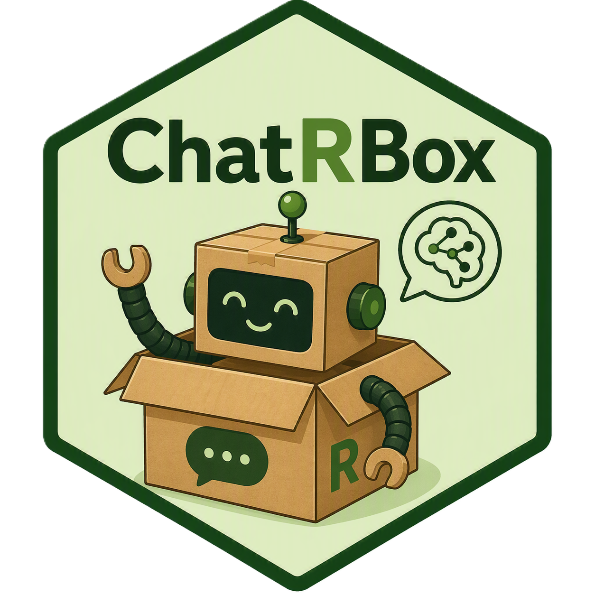

# ChatRBox: Your Chatbot Development Toolkit

 

## Background

ChatRBox offers a self-contained, modular MCP-like framework for
bridging AI models with real-world information, without complex MCP
set-up. ChatRBox pairs LLMs with deterministic workflows to execute
pre-defined tools using natural language user queries. This framework
includes OpenAPI schema parsing, client function generation, streamlined
tool registration and prompt injection of data. Whilst these features
are available through the flexibility of packages like `ellmer`, they
are automated within ChatRBox for immediate use. This means less time
debugging workflows and more time optimizing user experience!

 

## Why are Pfizer Sharing This?

The open-source nature of ChatRBox supports equity, transparency and
ownership. This aligns with Pfizer’s [three principles for responsible
AI usage in
healthcare.](https://www.pfizer.com/news/articles/three_principles_of_responsibility_for_artificial_intelligence_ai_in_healthcare)

 

## What is the Benefit of this Work?

ChatRBox supports wide-spread AI-literacy to drive AI adoption and
innovation in healthcare.

 

## How Should I Submit Questions, Queries and Enhancements?

You should fork this repository and submit a pull-request.

 

## Developers

Richard Virgen-Slane Ph.D.

Abigail Barnett

 

## How to Install ChatRBox

    # Setting the repo
    options(repos = c(
      CRAN = "https://cran.rstudio.com/" ))

    # Installing required packages and ChatRBox
    devtools::install_github("pfizer-opensource/ChatRBox",
                             dependencies = TRUE)

Here, we demonstrate a simple ChatRBox workflow to initialize and
interact with a chatbot named `session`.

 

### 1. Initializing Your Chatbot

We initialize a chat session using `ChatRBox$new()` and list the
`ellmer` `chat_` function (without closing brackets) and AI model of
choice. Below we initialize the `chat_ollama()` and
`chat_openai_compatible()` functions.

The Ollama provider is a local server with a simple set-up and no
required authentication. Users must install Ollama before supplying the
public base URL and chosen AI model. Here, we use the `mistral` model.

    session <- ChatRBox$new(ai_provider = ellmer::chat_ollama, 
                            base_url = Sys.getenv("OLLAMA_HOST", unset = "http://localhost:11434"),
                            model = Sys.getenv("OLLAMA_MODEL", unset = "mistral"))

`chat_ollama()` is the most accessible `ellmer` function, but known
disadvantages include weak tool-calling and limited input tokens.
Therefore, the `chat_openai_compatible()` function may be more suited to
complex workflows by connecting to OpenAI-compatible servers like vLLM,
LM Studio or cloud providers. Note that ChatRBox vignette and example
code has been written using `chat_ollama()`, yet is reproducible with
any `ellmer` `chat_` function.

Here, we initialize a chat session using the `chat_openai_compatible()`
function, vLLM provider and `gpt-oss-120b` model. Unlike
`chat_ollama()`, there is no default for OpenAI-compatible API base
URLs, meaning this must be acquired and assigned to the environment
variable `VLLM_BASE_URL`.

The `api_headers` argument is a named character vector of headers to
append to every API call, specific to the chosen server. Users are
advised to store this vector as a single serialized (JSON) string in an
environment file in their home directories (e.g., `.env`). This file may
be loaded in R using `readRenviron("~/.env")`, whilst the ChatRBox
`get_env_headers()` function de-serializes the string during chatbot
initialization. Here, we name the `api_headers` environment variable
`VLLM_API_HEADERS`.

    session <- ChatRBox$new(ai_provider = ellmer::chat_openai_compatible,
                            base_url = Sys.getenv("VLLM_BASE_URL"),
                            api_headers = get_env_headers("VLLM_API_HEADERS"),
                            model = "gpt-oss-120b")

`session` may be interacted with using `$talk()` and string inputs,
analogous to the `ellmer` `$chat()` method. Conversation is facilitated
through multiple `$talk()` calls and chatbots retain conversation memory
until R sessions are restarted.

    session$talk("How many states are there in the USA?")

    session$talk("Which of these begin with the letter A?")

 

### 2. Providing APIs and Tool Functions

Here, we define a simple addition tool in R and provide this to our
chatbot as a named list, using the `ChatRBox_update()` function. The
first argument of `ChatRBox_update()` is the name assigned to our
chatbot during initialization.

This function may be used to alter existing chatbot `R6` arguments,
meaning only additional tool functions should be listed, as any
previously provided remain available. All `ChatRBox_update()` arguments
may also be defined during chatbot initialization.

    add <- function(x,y) {
      x + y
    } 

    ChatRBox_update(object = session, tools_list = list(add_two_numbers = add))

    session$talk("Use a service to compute 70 + 76") 

Automatic AI summaries append to any API or tool output by setting the
`$talk()` argument `summarize` to `TRUE`. These are informed by the
default summary prompt, whilst custom summary prompts may be provided
per service using the `R6` argument `summary_list` upon chatbot
initialization or update.

    session$talk("Use a service to compute 23 + 30", summarize = TRUE) 

APIs may be provided as base URLs (no trailing slashes) or OpenAPI JSON
schema URLs (usually ‘/openapi.json’ appended to the base URL). These
are provided identically to above, except using `services_list` or
`openapi_list` in lieu of `tools_list`.

APIs provided using `services_list` must contain an endpoint named
`client_fns` that contains API client functions as R source code,
whereas client functions are automatically generated for APIs provided
using `openapi_list`. Therefore, `services_list` may be beneficial for
complex or internal APIs where greater user control is preferred, whilst
`openapi_list` is advantageous for external APIs.

Users may alter the `httr2` request parameters employed during client
function generation using the `httr2_config` `R6` argument upon chatbot
initialization or update.

 

### 3. Providing Data Frames

Here, we define a data frame in R and provide this to our chatbot using
`ChatRBox_update()`, this time via the `data_list` argument.
`example_data` is automatically interpolated into the AI prompt, such
that chatbots may view, summarize or manipulate this data frame.
Chatbots may also extract our data frame name for use as subsequent API
arguments during chained API calls.

    example_data <- data.frame(
      X = c(1, 2, 3, 4, 5, 6, 7, 8, 9, 10),
      Y = c(10, 13, 15, 18, 21, 20, 23, 27, 28, 30)
    )

    ChatRBox_update(object = session, data_list = list(example_data = example_data))

    session$talk("What's the third value in the Y column of my example data?")

    session$talk("What is the median value in the X column of my example data?")

Data set values may even be extracted and used as inputs in our previous
addition tool. Any tools, APIs or data frames remain accessible unless
chat sessions are re-initialized.

    session$talk("Use a service to add together the last two values from the X column of my example data")

  

## References

Wickham, H., Cheng, J., Jacobs, A., Aden-Buie, G., and Schloerke, B.
(2025) ellmer: Chat with Large Language Models (Version 0.4.0) \[R
package\]. Available at: <https://ellmer.tidyverse.org>
